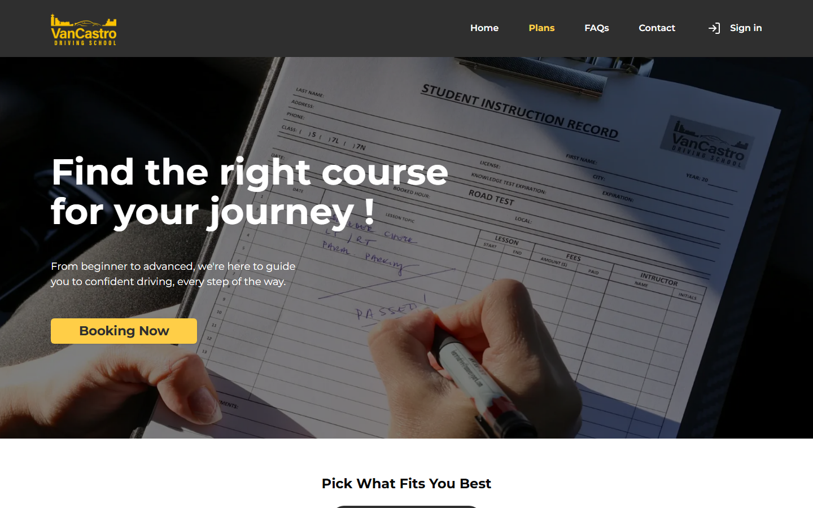

# Demo guide

Step-by-step walkthrough for testing the hosted VanCastro demo. Product context and my contribution are in the [README](./README.md).

**Live site:** [https://vancastro-driving-school-v1.vercel.app](https://vancastro-driving-school-v1.vercel.app)

> The Render API may take up to 60 seconds to wake after inactivity. If Sign in seems stuck, wait once and refresh. QuickBooks features use Intuit Sandbox, not a live company.

## Demo accounts

These are public test users. Do not change the passwords, enter real personal information, or create a new account.

| Role | Email | Password |
| --- | --- | --- |
| Instructor (school operations) | `vancastro.instructor.demo@gmail.com` | `vancastro.instructor.demo` |
| Student | `vancastro.student.demo@gmail.com` | `vancastro.student.demo` |

Use **two browser windows** (normal + Incognito, or Chrome + Edge). Clerk keeps one session per browser.

### Monthly database reset

Business data (purchases, invoices, lessons, availability) is wiped about once a month because the credentials are public. Login emails and passwords stay the same. After a reset, walk the flow from a clean database. Empty dashboards are expected until you create new data.

Please do not delete other testers’ records unless you created them in this session, and do not connect a real QuickBooks company.

## Before you start

1. Open the live site.
2. Prepare two windows: instructor and student.
3. Recommended license class: **Class 5**.
4. Pickup cities: **Vancouver**, **North Vancouver**, **Burnaby**, **Surrey**.
5. Time pickers are **24-hour**, in **15-minute** steps. Enter `22:00`, not `10:00 PM`.

Suggested order: public site → instructor availability (and QuickBooks if you will invoice) → student contract + purchase → instructor invoice → student booking → instructor approval.

A student **cannot book** until at least one invoice exists. Buying a package is not enough.

---

## Walkthrough A — Public website (no login)

About 3 minutes.

1. Open the live site.
2. On **Home**, scroll the landing hero, why-choose-us cards, instructors, reviews, steps, and plan cards.
3. Open **Plans**. Confirm lesson packages and service areas.
4. Open **FAQs** and expand a few policy items.
5. Open **Contact**.
6. Confirm **Sign in** in the header when logged out.

---

## Walkthrough B — Instructor setup

About 5–10 minutes. Do this **before** the student books.

### B1. Sign in

1. In window 1, click **Sign in**.
2. Use the instructor email and password above.
3. You should land on the instructor **Dashboard** (lesson calendar).

Instructor sidebar:

| Menu | What you should see |
| --- | --- |
| Dashboard | Calendar of upcoming lessons |
| Booking Requests | Pending student bookings to accept or decline |
| Students | Student list and per-student detail |
| Lessons | Approved lessons |
| Finance | Purchase requests, invoices, QuickBooks connection |
| Settings → Profile | Instructor profile |
| Settings → Availability | Hours students can book |
| Settings → Travel Time | Drive time between cities |

### B2. Confirm QuickBooks Sandbox

Invoices are created in QuickBooks as well as in this app.

1. Open **Finance**.
2. If you see **QuickBooks Connected**, you can create invoices.
3. If you see **Connect QuickBooks**, the sandbox connection was dropped (common after a database reset). You can still review calendar, students, availability, and travel time. Creating a new invoice needs the sandbox connection.

Do not connect a real Intuit production company.

### B3. Set availability

1. Open **Settings → Availability**.
2. Choose a **single day** or a **date range**.
3. Set From / To, for example `10:00` to `18:00`.
4. Save. Instructor and student on the same computer should see those same local hours.

### B4. Optional: travel time

1. Open **Settings → Travel Time**.
2. You should see pairs such as Vancouver ↔ Burnaby (30 min) and Vancouver ↔ Surrey (60 min).
3. The booking form uses these values so back-to-back lessons in different cities are not offered too close together.

---

## Walkthrough C — Student onboarding and purchase

About 8 minutes. Use window 2.

### C1. Sign in

1. Click **Sign in**.
2. Use the student email and password above.
3. First visit after a reset: complete **profile** (`/new-user`), then **contract**. Later visits: **Profile**.

Student sidebar:

| Menu | What you should see |
| --- | --- |
| Profile | Personal details |
| Purchase | Buy lesson packages for the signed license class |
| Lessons | Today / All lessons, plus **Book a new lesson** |
| Invoices | Pending purchases and issued invoices |
| Show Contract | Signed contract (after one exists) |

### C2. Sign a contract

Required before purchase.

1. You may be redirected automatically if no contract exists.
2. Choose **Class 5** for the shortest demo.
3. Draw a signature and submit.
4. You should return to the student dashboard.

The chosen class controls which packages appear on Purchase.

### C3. Buy a lesson package

1. Open **Purchase**.
2. Increase quantity on one Class 5 package, for example **Road lesson 60 min** ($70) or **Road lesson 90 min** ($90).
3. Choose an existing payer, or add a fake payer such as `Demo Payer`.
4. Submit.
5. Open **Invoices**. An amber **Pending Purchases** card is correct: the school has not invoiced yet.

Switch back to the instructor window.

---

## Walkthrough D — Instructor invoice and payment

About 5 minutes. Window 1.

Finance, invoice viewing, and payment confirmation were **not** frontend-led work. This section is here so reviewers can still complete the full school path.

### D1. Create the invoice

1. Open **Finance**.
2. Under **Purchase requests**, open the student’s pending purchase.
3. Confirm line items, total, and due date. Leave status **Unpaid**.
4. Submit.

Expected: the purchase leaves the pending list, a new invoice row appears, a matching QuickBooks Sandbox invoice is created, and the student **Invoices** page shows a real invoice after refresh.

If create invoice fails, QuickBooks is usually not connected (B2).

### D2. Record a payment

Payment is recorded **inside this app**. It does not create a QuickBooks Payment object.

1. Expand the new invoice on **Finance**.
2. Enter an amount and issue date. Submit.
3. Remaining balance should drop. Status becomes **Paid** or **Partially paid**.
4. Refresh the student **Invoices** page to confirm the same remaining amount.

---

## Walkthrough E — Student books a lesson

About 5 minutes. Window 2.

1. Open **Lessons** → **Book a new lesson**.
2. If you see **No invoice yet**, finish Walkthrough D first.
3. Choose a Class 5 duration, the demo instructor, and a pickup city.
4. Pick a date that has availability from B3, then a start time. End time is calculated from lesson length and travel time.
5. Submit. The lesson is **Pending**.

It should appear under **All** (and **Today** if booked today). The student can cancel a pending lesson from this list.

---

## Walkthrough F — Instructor accepts or declines

About 2 minutes. Window 1.

1. Open **Booking Requests**. Filter **Pending** if needed.
2. **Accept** → **Approved**. It should show on the calendar and Lessons list.
3. **Decline** → confirm → **Cancelled**. The student can book again.

Cancelled lessons are hidden on the instructor calendar.

---

## Walkthrough G — Students list and logout

Optional, about 3 minutes.

1. As instructor, open **Students** and open the demo student.
2. Header avatar → **Log out**. Confirm **Sign in** on the public site.
3. Sign in again. **My Dashboard** goes to `/instructor/dashboard` or `/student/dashboard` by role.

---

## Smoke checklist

**Public site**

- [ ] Home, Plans, FAQs, and Contact load
- [ ] Sign in is available in the header

**Accounts**

- [ ] Instructor signs in to the calendar
- [ ] Student signs in to the student dashboard
- [ ] A student does not see instructor Finance in the sidebar

**Student path**

- [ ] Class 5 contract can be signed
- [ ] A package can be purchased
- [ ] Invoices shows pending until the instructor invoices
- [ ] After invoicing, the student sees the invoice
- [ ] Book My Lesson offers instructor, city, date, and time
- [ ] A pending lesson appears under Lessons

**Instructor path**

- [ ] Availability saves and shows the hours you entered
- [ ] Finance lists the purchase request
- [ ] Creating an invoice adds an invoice row
- [ ] Booking Requests can Accept or Decline
- [ ] Approved lessons appear on the calendar

**Reset behavior**

- [ ] After empty data, the same accounts still sign in
- [ ] The flow can be repeated from contract → purchase → invoice → book → approve

---

## Lesson catalog

Purchase only shows types that match the signed license class. Prices in CAD.

| License class | Package | Length | Count | Price |
| --- | --- | --- | --- | --- |
| Class 5 | Road lesson 60 min | 60 min | 1 | $70 |
| Class 5 | Road lesson 90 min | 90 min | 1 | $90 |
| Class 5 | Pack of 2 classes of 90 min | 90 min | 2 | $170 |
| Class 5 | Pack of 3 classes of 90 min | 90 min | 3 | $250 |
| Class 5 | Road test 45 min warm-up plus rental car | 90 min | 1 | $150 |
| Class 7 | Road lesson 60 min | 60 min | 1 | $90 |
| Class 7 | Road lesson 90 min | 90 min | 1 | $100 |
| Class 7 | Pack of 10 classes of 60 min | 60 min | 10 | $850 |
| Class 7 | Road test 45 min warm-up plus rental car | 90 min | 1 | $150 |
| Class 4 | Road lesson 60 min | 60 min | 1 | $120 |
| Class 4 | Road lesson 90 min | 90 min | 1 | $150 |
| Class 4 | Road test 45 min warm-up plus rental car | 90 min | 1 | $250 |

Travel-time seed (minutes): Vancouver–North Vancouver 30, Vancouver–Burnaby 30, Vancouver–Surrey 60, North Vancouver–Burnaby 60, North Vancouver–Surrey 90, Burnaby–Surrey 30.
