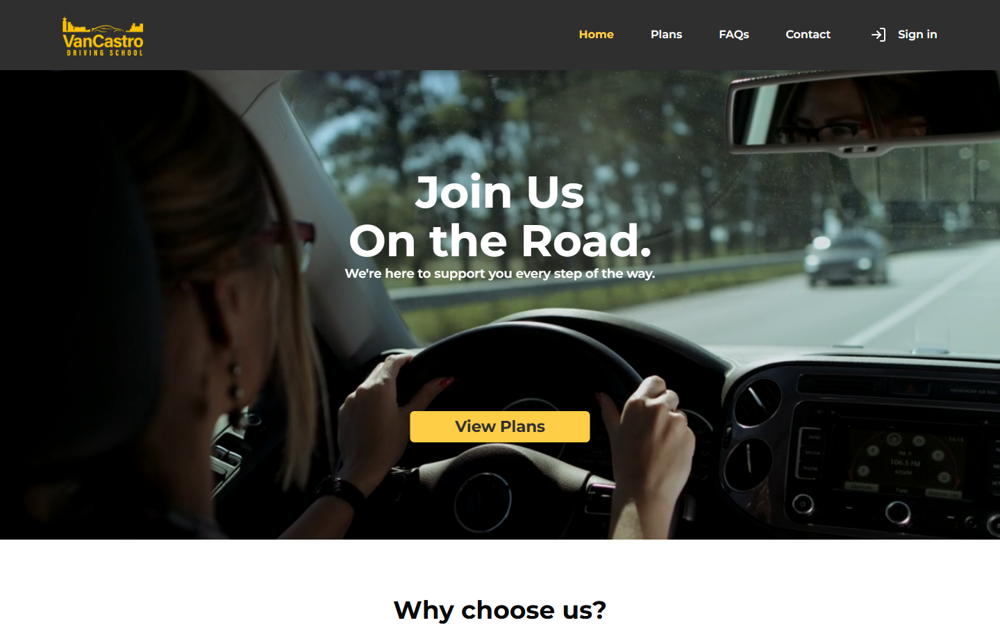

# VanCastro Driving School

A full-stack scheduling and operations platform that connects student purchases, invoicing, instructor availability, and lesson booking in one workflow.

[Live Demo](https://vancastro-driving-school-v1.vercel.app) · [Demo Guide](./DEMO_GUIDE.md) · [Architecture](./ARCHITECTURE.md)



> Team capstone project — I primarily contributed to the frontend experience, dashboard workflows, scheduling interfaces, and frontend–API integration.

## Project overview

VanCastro is a Vancouver driving school product with a public marketing site and authenticated student / instructor dashboards. The school’s real work is a handoff, not a single form: a student cannot book until they have a contract and an invoice, and an instructor cannot accept a lesson that was never requested.

Students sign a license-class contract, buy lesson packages, and book lessons. Instructors publish availability, review booking requests, and run billing through QuickBooks Online Sandbox. The hosted demo is that full path, not a brochure: **purchase → invoice → book → approve**.

## My contribution

This was a **team capstone**. I owned the **frontend experience** and frontend–backend integration. A teammate led the Express API, Prisma data layer, and QuickBooks server integration.

I built and iterated on:

- Student and instructor dashboard interfaces, including role-specific sidebars
- Booking and instructor scheduling workflows (`book-my-lesson`, availability form, FullCalendar dashboard)
- Travel-time-aware slot filtering so back-to-back lessons in different cities are not offered
- Browser-local UTC conversion for availability (needed after server-side conversion shifted demo hours)
- Role-aware navigation and Clerk-protected user flows
- Frontend REST adapters, plus loading and error states
- Responsive public site (Home, Plans, FAQs, Contact) and dashboard layout

I also collaborated on API contracts, Clerk authentication, Vercel / Render / Neon deployment debugging, GitHub Actions CI, and end-to-end testing of the demo path.

I did **not** lead invoice viewing, payment confirmation, or the QuickBooks OAuth / persistence layer. Those remain teammate-owned backend and finance features. I consumed those APIs from the instructor UI and helped harden demo-facing error states around invoice creation.

## Key features

- **Role-based dashboards** — students see profile, purchase, lessons, and invoices; instructors see calendar, booking requests, students, finance, availability, and travel time
- **Availability-aware booking** — open slots respect instructor hours, lesson length, and travel time between Vancouver, North Vancouver, Burnaby, and Surrey
- **End-to-end school workflow** — pending purchase → instructor invoice → student booking → instructor approval
- **Clerk authentication** on both the Next.js app and Express API, with frontend route guards and backend role middleware
- **QuickBooks Online Sandbox** invoice create/update (backend-led; used from the instructor finance UI)
- **Deployed demo** on Vercel, Render, and Neon PostgreSQL, with CI on `dev` and `main`

## Engineering challenges

### Availability across time zones

Availability is stored as UTC ranges. Converting it during Next.js server rendering used the Vercel server clock (UTC), which shifted slots by eight hours for a local demo. The final implementation converts in the **browser**, so instructor and student on the same machine see the same local times.

### Preventing unrealistic back-to-back bookings

Open slots are not a raw availability dump. The booking UI subtracts existing lessons, then pads those busy windows with **travel time** between pickup cities so the instructor is not offered consecutive lessons they cannot physically reach.

### Coordinating role-based workflows

A purchase does not immediately become a bookable lesson. The UI follows the school’s real handoff: student purchase stays **pending** until the instructor invoices; booking starts **pending** until the instructor accepts or declines. Frontend route guards and status-specific screens make that sequence visible; backend role rules were added with the teammate during demo hardening.

## Tech stack

| Layer | Tools |
| --- | --- |
| Frontend | Next.js 15, React 19, TypeScript, Tailwind CSS, Radix UI, FullCalendar |
| Auth | Clerk |
| Backend | Node.js 22, Express, Prisma 6, PostgreSQL |
| Accounting | QuickBooks Online Sandbox (Intuit OAuth) |
| CI / host | GitHub Actions, Vercel, Render, Neon |

## Architecture

```text
Browser → Next.js (Vercel)
       → Clerk session
       → server-side adapters (frontend/utils)
       → Express /api/v1 (Render)
            → Clerk auth + role middleware
            → Prisma → PostgreSQL (Neon)
            → QuickBooks Online Sandbox
```

Request pipeline, data model, authorization, and deployment notes: [ARCHITECTURE.md](./ARCHITECTURE.md).

## Demo access

| Role | Email | Password |
| --- | --- | --- |
| Instructor | `vancastro.instructor.demo@gmail.com` | `vancastro.instructor.demo` |
| Student | `vancastro.student.demo@gmail.com` | `vancastro.student.demo` |

Use two browsers (or one normal window and one Incognito). Please do not change the passwords or enter real personal data.

### Try the core workflow

1. Sign in as the instructor and create availability.
2. Sign in as the student in another browser and purchase a lesson package.
3. Create the invoice from the instructor account.
4. Book a lesson as the student.
5. Approve the request as the instructor.

Credentials, sidebar maps, catalog prices, and a smoke checklist: [DEMO_GUIDE.md](./DEMO_GUIDE.md).

> The API may take up to 60 seconds to wake after inactivity. Public business data is reset about once a month. QuickBooks features run against a sandbox, not a live company.

## Local development

Node.js 22, PostgreSQL, and Clerk development keys. Copy `frontend/.env.example` and `backend/.env.example`.

```bash
cd backend && npm install && npx prisma generate && npx prisma migrate dev && npx prisma db seed && npm run dev
cd frontend && npm install && npm run dev
```

Seed creates lesson types and travel times only. New Clerk users are students until an instructor role is set in the database.

## Known limitations

- No separate admin console (`ADMIN` exists in the schema only)
- Recorded payments update the local invoice; they are not synced as QuickBooks Payments
- Lesson status is `PENDING` / `APPROVED` / `CANCELLED` (no completed state in the database)
- CI gates install, lint, typecheck, build, and API health; it is not a full product test suite
- Leftover availability slots from earlier timezone experiments may need to be deleted and saved again
- Remaining API authorization follow-ups: purchases are not yet role-scoped, user PATCH is not ownership-checked, and QuickBooks OAuth sits outside the Clerk session

## Team

Capstone team project. **Yi-En Tsai** — frontend, scheduling UX, frontend–API integration, demo launch and deployment debugging. Backend API, Prisma schema, and QuickBooks server integration were led by a teammate.
